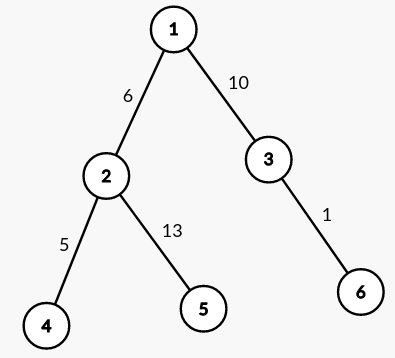
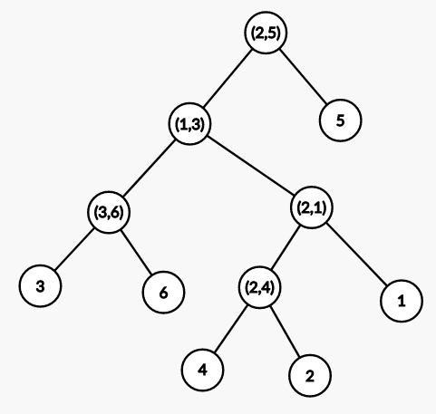

## Lời nói đầu

Một số bài viết nên đọc trước khi tiếp tục:
- [Disjoint Set Union](https://vnoi.info/wiki/algo/data-structures/disjoint-set-union.md)
- [Bài toán RMQ và bài toán LCA](https://vnoi.info/wiki/translate/topcoder/Range-Minimum-Query-and-Lowest-Common-Ancestor.md)
- [Thuật toán Kruskal](https://vnoi.info/wiki/algo/graph-theory/minimum-spanning-tree.md#1-thu%E1%BA%ADt-to%C3%A1n-kruskal)

Cây DSU là một kỹ thuật không phải là quá phức tạp hay xuất hiện quá ít trong giới Competitive Programming, nhưng kỳ lạ thay những bài viết về nó lại chỉ đếm được bằng đầu ngón tay. Cái tên “Cây DSU” không phải là một cái tên chính thức của kỹ thuật này, nó còn xuất hiện dưới nhiều cái tên khác như Reachability Tree hay Kruskal Reconstruction Tree. Không ai rõ kỹ thuật này xuất hiện từ lúc nào, cá nhân mình cũng chỉ biết được rằng những lời giải sử dụng kỹ thuật này đã xuất hiện vào những năm 2000 ở Trung Quốc.

Vậy cây DSU được sử dụng để làm gì? Sức mạnh của cây DSU nằm ở việc nó có thể biểu diễn các thành phần liên thông dưới dạng cây. Từ đây, chúng ta có thể sử dụng được Euler Tour cùng với các cấu trúc dữ liệu xử lý đoạn.

## Cách xây dựng từ một đồ thị gốc

Cây DSU là một cây có gốc gồm $N + M$ đỉnh với $N$ và $M$ lần lượt là số đỉnh và số cạnh của đồ thị gốc. Trong đó, cây DSU sẽ có $N$ lá biểu diễn cho các đỉnh ở trong đồ thị gốc, $M$ đỉnh còn lại sẽ biểu diễn cho các cạnh.

Để xây dựng cây DSU, chúng ta khởi tạo $N$ đỉnh đầu tiên, rồi duyệt qua từng cạnh một theo độ lớn tăng dần (giảm dần). Khi thêm cạnh $(u,v)$, chúng ta tạo thêm một đỉnh ảo để biểu diễn cho cạnh này đồng thời gán nó làm cha của đại diện thành phần liên thông của lần lượt $u$ và $v$. Trong một số bài toán, chúng ta có thể bỏ qua những cạnh nối hai đỉnh cùng một thành phần liên thông và từ đó có được cây DSU gồm $2N-1$ đỉnh.


## Cài đặt

Sau khi hiểu được cây DSU được cấu tạo nên như thế nào, xây dựng cây DSU là một công việc khá dễ dàng và nhanh gọn khi chúng ta chỉ cần chỉnh sửa hàm $find$ và $join$ của DSU một chút như sau:

```c++
// lưu thông tin cha của các đỉnh trong cây DSU
int par[MAXN];
// vector lưu đồ thị cây DSU
vector < int > g[MAXN];
int n; // lưu số đỉnh của cây

// cài đặt tương tự như DSU thông thường
int find(int u) {
  return (par[u] == u) ? u : par[u] = find(par[u]);
}

void join(int u, int v) {
  u = find(u);
  v = find(v);
  // tạo thêm một đỉnh đại diện cho cạnh
  n++;
  par[n] = n;
  par[u] = n;
  par[v] = n;
  g[n].push_back(u);
  g[n].push_back(v);
}
```

## Độ phức tạp thời gian
Có 2 điều chúng ta cần chú ý khi xây dựng cây DSU:
- Không thể sử dụng phương pháp tối ưu gộp theo kích cỡ / độ cao như trong DSU thông thường
- Vẫn có thể sử dụng phương pháp tối ưu nén đường đi như trong DSU

Như đã được phân tích chi tiết ở trong [bài viết khác](https://vnoi.info/wiki/algo/data-structures/disjoint-set-union.md) về DSU ở trên VNOI Wiki, nếu chúng ta chỉ sử dụng phương pháp tối ưu nén đường đi thì độ phức tạp trung bình của thao tác $find$ cũng chỉ là $O(log(n))$. Do đó độ phức tạp thời gian của việc xây dựng cây DSU chỉ là $O(n * log(n))$.

## Bài toán 1: Path Max Queries
### Đề bài
Cho một cây gồm $N$ đỉnh và $N-1$ cạnh có trọng số. Với mỗi truy vấn, hãy tìm cạnh có trọng số lớn nhất trên đường đi từ đỉnh $u$ đến đỉnh $v$.
### Nhận xét
Không quá khó để chúng ta giải quyết bài toán trên bằng cách sử dụng kỹ thuật Heavy-Light Decomposition hay Binary Lifting. Nhưng với hai giải pháp ở trên, độ phức tạp cho mỗi truy vấn lần lượt là $O(log^2(n))$ và $O(log(n))$. Liệu có cách nào để chúng ta tiền xử lý cây trong $O(n * log(n))$ và trả lời mỗi truy vấn với độ phức tạp chỉ là $O(1)$ hay không?

Câu trả lời là có! Và nó nằm ở chính cây DSU.

### Lời giải
Chúng ta sẽ sort các cạnh theo trọng số tăng dần rồi sau đó xây dựng lên cây DSU (tương tự như thuật toán Kruskal). Nhìn vào hai đồ thị bên dưới chúng ta có thể đưa ra một nhận xét: cạnh có trọng số lớn nhất trên đường đi từ đỉnh $u$ đến $v$ chính là LCA của chúng trên cây DSU. 






Mặt khác, từ [bài viết về RMQ và LCA](https://vnoi.info/wiki/translate/topcoder/Range-Minimum-Query-and-Lowest-Common-Ancestor), chúng ta đã biết rằng việc tính toán LCA trong $O(1)$ bằng cách sử dụng Euler Tour và cấu trúc dữ liệu chẳng hạn như Sparse Table là điều hoàn toàn có thể.

Như vậy, bài toán đã được giải quyết!
Độ phức tạp: $O(N * log (N) + Q)$ với $N$ và $Q$ lần lượt là số đỉnh và số truy vấn.

## Bài toán 2: Codeforces 1416D - Graph and queries

### Tóm tắt
Cho đồ thị $N$ đỉnh và $M$ cạnh. Mỗi đỉnh có một số hiệu $p_i$ đôi một khác nhau được viết lên nó. Xử lý các loại truy vấn sau
- Truy vấn loại 1: $1 \text{ }v$ - Tìm đỉnh $u$ cùng thành phần liên thông với đỉnh $v$ có số hiệu lớn nhất. In ra số hiệu được viết lên đỉnh $u$ và thay đổi số hiệu của $u$ thành $0$.
- Truy vấn loại 2: $2 \text{ }i$ - Xóa cạnh thứ $i$ của đồ thị.

### Lời giải
Ở các bài toán có xuất hiện truy vấn xóa cạnh, do tính một chiều của cấu trúc dữ liệu DSU, chúng ta có thể nghĩ đến cách đảo ngược thứ tự của các truy vấn của bài để giải.

Chúng ta có thể xử lý bài này như sau:
- Thực hiện nối các cạnh không bị xóa
- Thêm dần các cạnh bị xóa theo thứ tự từ dưới lên bằng cách sử dụng DSU
- Áp dụng cây DSU từ đó xác định được thành phần liên thông của đỉnh $v$ tại mọi thời điểm
- Sử dụng Euler Tour và Segment Tree để xử lý bài toán tìm max trong khoảng và update tại một điểm

Độ phức tạp: $O((n + m + q) * log(n))$

Giá trị của cây DSU trong bài tập này chính là biểu diễn các thành phần liên thông tại từng thời điểm dưới dạng cây, thứ mà chúng ta quen thuộc hơn và có nhiều công cụ để giải quyết các bài toán hơn.

### Cài đặt

```c++
#include <bits/stdc++.h>

using namespace std;
int
const MAXN = 7e5 + 5;
int n, m, q;
int label[MAXN];
pair < int, int > edge[MAXN], query[MAXN];
bool del[MAXN];

// Xây dựng cây DSU
vector < int > g[MAXN];
int par[MAXN];

int find(int u) {
  if (par[u] == u) return u;
  return par[u] = find(par[u]);
}

void join(int u, int v) {
  u = find(u);
  v = find(v);
  if (u == v) return;
  n++;
  par[n] = n;
  par[u] = n;
  par[v] = n;
  g[n].push_back(u);
  g[n].push_back(v);
}

// Xây dựng Euler Tour trên cây DSU
int tin[MAXN], tout[MAXN];
int now = 0;
void dfs_time(int u, int p = -1) {
  tin[u] = ++now;
  for (int v: g[u]) {
    if (v == p) continue;
    dfs_time(v, u);
  }
  tout[u] = now;
}

// Segment tree trên Euler Tour để xử lý truy vấn 1
#define left node << 1, tl, tm
#define right node << 1 | 1, tm + 1, tr
pair < int, int > st[MAXN << 2];

void update(pair < int, int > val, int pos, int node = 1, int tl = 1, int tr = now) {
  if (tl == tr) {
    st[node] = val;
    return;
  }
  int tm = (tl + tr) >> 1;
  if (pos <= tm) update(val, pos, left);
  else update(val, pos, right);
  st[node] = max(st[node << 1], st[node << 1 | 1]);
}

pair < int, int > get(int l, int r, int node = 1, int tl = 1, int tr = now) {
  if (l > r || r < tl || l > tr) return make_pair(0, 0);
  if (l <= tl && tr <= r) {
    return st[node];
  }
  int tm = (tl + tr) >> 1;
  return max(get(l, r, left), get(l, r, right));
}

void solve() {
  cin >> n >> m >> q;
  for (int i = 1; i <= n; i++) {
    cin >> label[i];
  }
  for (int i = 1; i <= m; i++) {
    cin >> edge[i].first >> edge[i].second;
  }
  for (int i = 1; i <= q; i++) {
    cin >> query[i].first >> query[i].second;
    if (query[i].first == 2) {
      del[query[i].second] = true;
    }
  }
  // setup dsu căn bản
  for (int i = 1; i <= n; i++) {
    par[i] = i;
  }
  // nối các cạnh không bị xóa
  for (int i = 1; i <= m; i++) {
    if (del[i]) continue;
    join(edge[i].first, edge[i].second);
  }

  // xác định thành phần liên thông của đỉnh v mỗi khi bị truy vấn
  for (int i = q; i >= 1; i--) {
    if (query[i].first == 2) {
      int id = query[i].second;
      join(edge[id].first, edge[id].second);
    } else {
      query[i].second = find(query[i].second);
    }
  }

  // xây dựng euler tour trên dsu-tree
  for (int i = 1; i <= n; i++) {
    if (par[i] != i) continue;
    dfs_time(i);
  }
  // đặt các số hiệu về giá trị gốc vào segment tree trên euler tour
  for (int i = 1; i <= n; i++) {
    update({
      label[i],
      tin[i]
    }, tin[i]);
  }
  // xử lý truy vấn
  for (int i = 1; i <= q; i++) {
    if (query[i].first == 2) continue;
    int root = query[i].second; // tìm thành phần liên thông của đỉnh v trong cây DSU vào thời điểm hiện tại
    pair < int, int > ans = get(tin[root], tout[root]); // truy vấn tìm max trên Segment Tree
    cout << ans.first << endl;
    if (ans.first != 0) {
      update({
        0,
        ans.second
      }, ans.second); // cập nhật số hiệu đỉnh u thành 0 trên Segment Tree
    }
  }
}

signed main() {
  ios_base::sync_with_stdio(0);
  cin.tie(0);
  cout.tie(0);
  solve();
}
```
Hoặc các bạn có thể theo dõi tại [submission trên Codeforces](https://codeforces.com/contest/1416/submission/188630658).

## Tổng kết
Ở trên là tất cả những gì căn bản nhất của cây DSU. Mong rằng qua bài viết này các quý độc giả đã có được thêm một công cụ hữu ích để giải quyết các bài tập trong tương lai.

## Một số bài tập để luyện tập kỹ thuật
- [Werewolf IOI 2018](https://ioi2018.jp/wp-content/tasks/contest1/werewolf.pdf)
- [USACO 2014 January Contest Gold - Ski Course Rating](http://www.usaco.org/index.php?page=viewproblem2&cpid=384)
- [Codechef TULIPS - Tiptoe through the tulips](https://www.codechef.com/problems/TULIPS)
- [Codechef CHEFCOMP - Chefina and Strange Tree](https://www.codechef.com/problems/CHEFCOMP)
- [APIO 2020 - Swapping Cities](https://tlx.toki.id/problems/apio-2020/B)
- [Codeforces 1706E - Qpwoeirut and Vertices](https://codeforces.com/contest/1706/problem/E)
- [Codeforces 1628E Groceries in Meteor Town](https://codeforces.com/problemset/problem/1628/E)
## Tham khảo
- [Reachability Tree/DSU Tree Tutorial - Codeforces](https://codeforces.com/blog/entry/85714)
- [Codeforces ](https://codeforces.com/blog/entry/71568)
- [Mzhang2021's Blog](https://mzhang2021.github.io/cp-blog/kruskal/)
