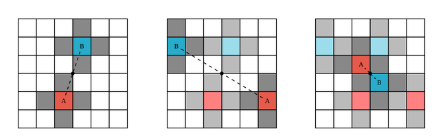
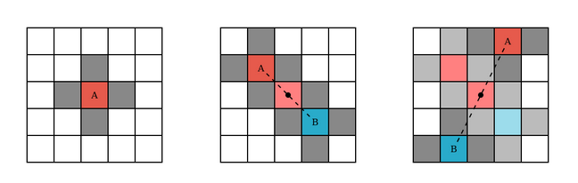
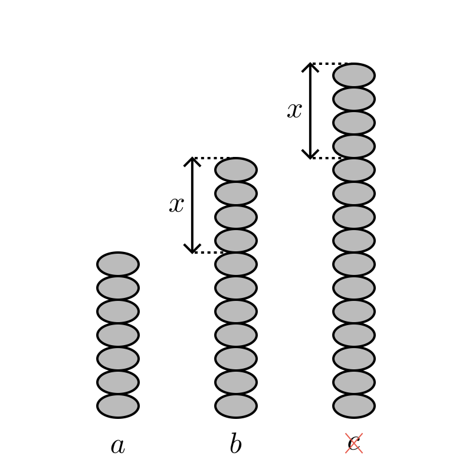
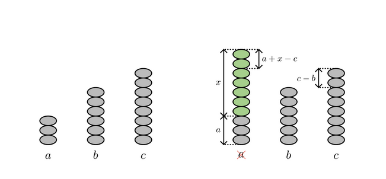
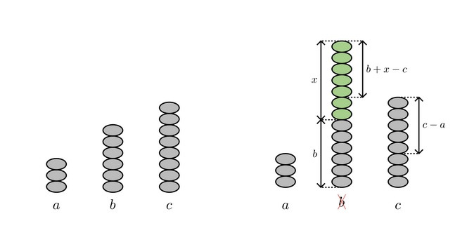

## Giới thiệu

Lí thuyết trò chơi (game theory) là một công cụ được dùng để nghiên cứu các tình huống xã hội (cuộc chơi) giữa các bên cạnh tranh nhau. Trên một vài khía cạnh, lí thuyết trò chơi là khoa học về chiến lược, về những tình huống chiến thuật trong đó người chơi chọn các hành động khác nhau để cố gắng thay đổi kết quả theo hướng có lợi cho mình, hay nói cách khác, tối ưu hóa kết quả.

Một trong những bài toán nổi tiếng nhất là [Song đề tù nhân (Prisoner's dilemma)](https://en.wikipedia.org/wiki/Prisoner%27s_dilemma). A và B bị bắt vào tù, và mỗi người có hai lựa chọn - đầu thú hay không đầu thú - với những kết cục khác nhau. Nhìn thoáng qua thì trò chơi trông rất đơn giản, tuy nhiên ẩn trong đó là hai hướng suy nghĩ tuy đều hợp lí, song lại đối lập nhau.

Trò chơi và lí thuyết trò chơi cũng rất phổ biến trong lập trình thi đấu vì sự đa dạng về độ khó và thể thức của nó. Tuy nhiên, [lí thuyết trò chơi](https://vnoi.info/wiki/algo/math/game-theory.md) chỉ đề cập đến những dạng *trò chơi tổ hợp cân bằng*, mà không bao phủ những dạng khác có thể xuất hiện.

Trong bài viết này, ta sẽ xem xét qua một số trò chơi sử dụng tính chất **đối xứng**. Khi "môi trường" của trò chơi là một bảng một đến hai chiều nào đó, thì một chiến thuật thường xuất hiện sẽ là chơi đối xứng qua tâm hoặc trục đối xứng của bảng. Ngoài ra, đôi lúc ta sẽ sử dụng việc một vài tính chất có **vai trò tương tự nhau**. 

## CF 630R Game

### Đề bài

Hai người A và B chơi một trò chơi như sau:

Cho một bảng hình vuông có kích thước $n \times n$. Ở một lượt, người chơi tô màu một ô vuông mà **không** chung cạnh với bất kì ô vuông nào đã được tô màu từ trước. Ai không tô được ô vuông nữa là người thua cuộc.

Hai người lần lượt chơi với nhau, với A là người đi đầu tiên. Biết rằng cả hai người chơi tối ưu, hỏi ai là người thắng cuộc?

**Giới hạn**: $1 \le n \le 10^{18}$.

### Lời giải

Đánh số các ô trong bảng từ $(1, 1)$ đến $(n, n)$. Xét tính chẵn lẻ của $n$:

- Khi $n$ chẵn, B sẽ thắng.

  Nếu A tô màu ô $(x, y)$, thì B chỉ cần tô màu ô $(n+1-x, n+1-y)$ - ô đối xứng với $(x, y)$ qua tâm bảng.

  Vì hai ô đối xứng nhau không bao giờ kề cạnh nhau, và trạng thái của bảng luôn đối xứng qua tâm (nếu A tô màu được thì B cũng tô màu được), nên B luôn luôn đi được như vậy. Vậy A phải là người không tô được đầu tiên, tức là B là người thắng cuộc.

- Khi $n$ lẻ, A sẽ thắng.

  Ở lượt đầu tiên, A sẽ tô màu ô $\left(\left\lceil \frac{n}{2} \right\rceil, \left\lceil \frac{n}{2} \right\rceil\right)$ - ô ở tâm của bảng. Sau đó, A chỉ việc đi đối xứng với B qua tâm. Tương tự như lập luận khi $n$ chẵn, ta có thể thấy A là người thắng cuộc.

## CF 197A Plate Game

### Đề bài

Hai người A và B chơi một trò chơi như sau:

Cho một tờ giấy hình chữ nhật kích thước $n$ (cm) $\times$ $m$ (cm). Trong một lượt, người chơi cắt đi một hình tròn bán kính $l$ (cm) nguyên vẹn, không được khuyết ở chỗ nào. Ai không cắt được hình tròn nữa là người thua cuộc. 

Hai người lần lượt chơi với nhau, với A là người đi đầu tiên. Biết rằng cả hai người chơi tối ưu, hỏi ai là người thắng cuộc?

**Giới hạn**: $1 \le n, m, l \le 100$.

### Lời giải

Cũng tương tự như bài trên, ta có thể đoán chiến thuật tối ưu của A là đặt một hình tròn vào tâm của tờ giấy, rồi đi đối xứng với B trong các nước đi còn lại.

Tuy nhiên, đừng vội vàng mà nghĩ rằng A sẽ thắng trong mọi trường hợp! Nếu như $n < 2l$ hoặc $m < 2l$, thì ngay từ đầu A đã không thể cắt một hình tròn nguyên vẹn ra khỏi tờ giấy.

## CF 1451D Circle Game

### Đề bài

Hai người A và B chơi một trò chơi như sau:

Có một đồng xu lúc đầu ở điểm $(0, 0)$ trên mặt phẳng hai chiều. Ở một lượt, giả sử đồng xu đang ở tọa độ $(x, y)$, thì người chơi được phép di chuyển đồng xu bằng một trong hai cách như sau:

- $(x, y) \rightarrow (x + k, y)$
- $(x, y) \rightarrow (x, y + k)$

Sau khi di chuyển, đồng xu phải nằm trong hình tròn tâm $(0, 0)$ bán kính $d$. Nói cách khác, trong mọi thời điểm, $x^2 + y^2 \le d^2$. Ai không di chuyển được đồng xu nữa là người thua cuộc.

Hai người lần lượt chơi với nhau, với A là người đi đầu tiên. Biết rằng cả hai người chơi tối ưu, hỏi ai là người thắng cuộc?

**Giới hạn**: $1 \le k \le d \le 10^5$.

### Lời giải

Do trong một lượt ta chỉ được tăng tọa độ $x$ hoặc tọa độ $y$ của đồng xu, nên chắc chắn ta sẽ không thể chơi đối xứng qua tâm mặt phẳng (điểm $(0, 0)$) được rồi.

Tuy nhiên, ta có thể thấy rằng trục $x$ và $y$ có vai trò như nhau. Do vậy, nếu như một người chơi tăng $x$ lên $k$ ở lượt của mình, thì người còn lại có thể tăng $y$ lên $k$ ở lượt tiếp theo. Nói cách khác, người chơi có thể giữ đồng xu ở trên một đường chéo nào đó.

Phát triển ý tưởng này thêm sẽ đưa ta đến lời giải:

Gọi $X$ là giá trị cao nhất thỏa mãn $X$ chia hết cho $k$ và điểm $(X, X)$ nằm trong hình tròn bán kính $d$. Khi đó:

- Nếu điểm $(X, X + k)$ nằm ngoài hình tròn bán kính $d$, thì B thắng.

  B sẽ làm chiến thuật trên để "giữ" đồng xu ở trên đường chéo $y = x$. Khi B di chuyển đồng xu đến điểm $(X, X)$, thì A không còn nước đi hợp lệ nữa (do cả hai điểm $(X + k, X)$ và $(X, X + k)$ đều nằm ngoài hình tròn).

- Nếu điểm $(X, X + k)$ nằm trong hình tròn bán kính $d$, thì A thắng.

  Ở nước đi đầu tiên, A sẽ di chuyển đồng xu đến điểm $(0, k)$, sau đó "giữ" đồng xu ở trên đường chéo $y=x+k$. Khi đến điểm $(X, X + k)$, thì B chỉ còn hai nước đi có thể là $(X + k, X + k)$ và $(X, X + 2k)$.
  
  Tuy nhiên, theo định nghĩa của $X$, điểm $(X + k, X + k)$ nằm ngoài hình tròn. Ngoài ra, $(X^2+(X+2k)^2) - ((X+k)^2+(X+k)^2) = 2k^2 > 0$, nên điểm $(X, X + 2k)$ cũng nằm ngoài hình tròn tâm $(0, 0)$ bán kính $d$.

## CF 1375F Integer Game

### Đề bài

Hai người A và B chơi một trò chơi như sau:

Có ba chồng đá, lúc đầu mỗi chồng có lần lượt $a$, $b$, $c$ viên đá, với $a$, $b$, $c$ là ba số nguyên dương **đôi một phân biệt**. Ở mỗi lượt:

- A chọn một số nguyên dương $x$ và đưa cho B số đó.
- B sẽ thêm $x$ viên đá vào một trong ba chồng đá, với điều kiện là **B không được chọn cùng một chồng đá trong hai lượt liên tiếp**.

B sẽ thua nếu như, tại bất kì thời điểm nào, tồn tại hai chồng đá có cùng số lượng đá. A sẽ thua nếu như B chưa thua sau $1000$ lượt chơi.

Biết rằng cả hai người chơi tối ưu, hỏi ai là người thắng cuộc?

### Lời giải

Không mất tính tổng quát, giả sử $a<b<c$.

Đầu tiên, B ~~chơi đá~~ thua khi nào? Đó là khi ở lượt cuối cùng, ta có:
- $a+x=b$, nên B không được chọn chồng $a$. $(1)$
- $b+x=c$, nên B không được chọn chồng $b$. $(2)$
- Ở lượt trước đó, B đã thêm vào chồng $c$ hiện tại, nên B không thể chọn lại chồng $c$ nữa. ($3$)

Nhận thấy ở tình huống trên, $a$, $b$, $c$ tạo thành một *cấp số cộng*. Nói cách khác, $a$ và $c$ đối xứng nhau qua $b$: $c-b=b-a=x$.

Vậy ở lượt trước đó, A sẽ đi như thế nào để "dồn" B vào trường hợp trên?

Giả sử ở lượt này Việt thêm vào chồng $a$ một lượng là $x$, vậy số đá mới sẽ là $b < c < a + x$. Lưu ý rằng ta phải chọn $x$ đủ lớn để thỏa mãn điều kiện $3$. Để thỏa mãn điều kiện $(1)$ và $(2)$, ta có:$$
\begin{array}{rccl}
     & a+x-\,&c&=c-b \\
\iff &       &x&=2c-a-b
\end{array}$$

Để ý rằng ở phương trình trên, $a$ và $b$ **có vai trò tương tự nhau**. Nói cách khác, kể cả khi ở lượt này B thêm vào chồng $b$ một lượng là $x=2c-b-a$, thì giá trị mới của các chồng đá vẫn tạo thành một cấp số cộng.

Thật vậy, số đá mới của ba chồng đá sẽ là $a<c<2c-a$, và $2c-a-c=c-a$.

    
Như vậy, B chỉ còn lại một nước đi duy nhất là chọn chồng đá lớn nhất $c$. Tuy nhiên, nếu ta làm chiến thuật trên một lần nữa, thì theo luật B phải chọn một trong hai chồng còn lại.

Kết luận: Nếu cả hai người chơi tối ưu thì A có chiến thuật luôn luôn thắng B trong duy nhất ba lượt chơi.
