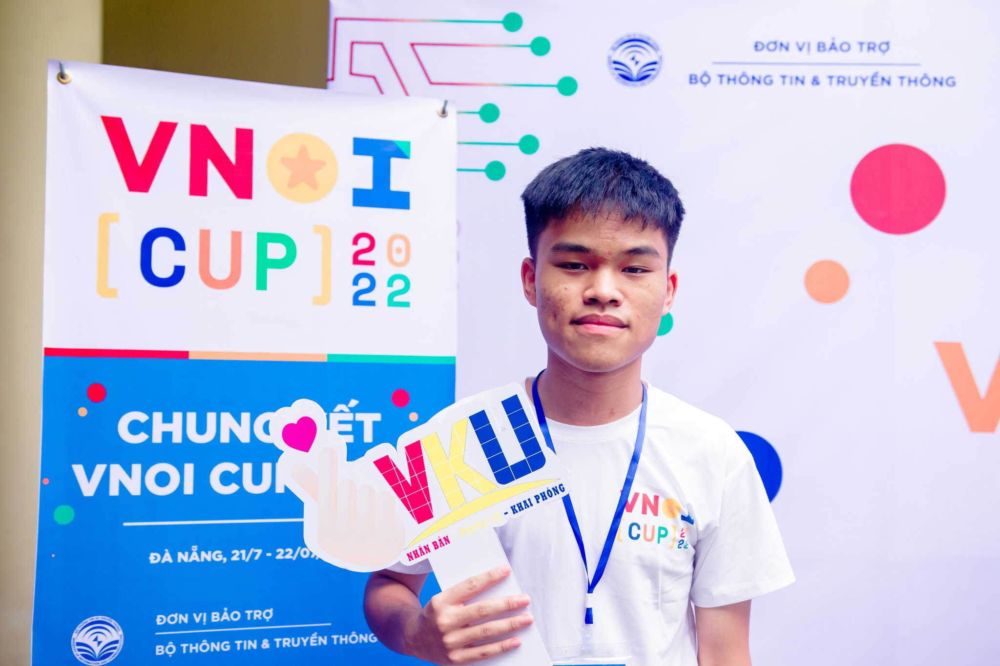

Q: Chào Bách, bạn có thể giới thiệu đôi chút về bản thân cũng như thành tích nổi bật của bạn được không?

A: Em tên là Trần Xuân Bách, học lớp 12 trường THPT Chuyên Khoa học Tự nhiên, Hà Nội. Năm lớp 10, em đạt giải Nhì VOI 2020, huy chương đồng APIO. Sang năm lớp 11, em may mắn có cho mình huy chương vàng APIO và huy chương vàng IOI .

Q: Được biết Bách bắt đầu học Tin từ rất sớm, không biết cơ duyên nào đã đưa bạn đến môn học này?

A: Hè năm lớp 6, mẹ có tìm cho em một trại hè. Đó là HSGS Codecamp của thầy Phương tổ chức. Vào đấy, em được học về C++, được làm trang codefun của thầy Phương. Em nhận ra việc code khá logic đối với một người chuyên toán như em. Và sau khi biết được cách những dòng code hoạt động, em đã tự mày mò khám phá, từ đó bắt đầu tập trung sâu hơn về môn này.

Q: Cảm xúc của bạn như nào khi biết được mình được tuyển thẳng vào THPT Chuyên KHTN?

A: Em được biết nếu được giải Nhất thì sẽ được tuyển thẳng vào chuyên KHTN từ năm lớp 8 rồi, em cũng đã thi từ năm lớp 8 nhưng chỉ được giải Nhì thôi. Lúc biết mình đạt giải Nhất TP, em cảm thấy khá là may mắn và cũng tiện nữa .

Q: Đối với Bách thì việc học ở cấp 3 và cấp 2 có khác biệt gì quá lớn không?

A: Thật ra thì em học trên lớp rất ít. Em chưa lên lớp buổi nào bao giờ luôn, toàn học đội tuyển thôi . Theo em thấy ở KHTN thì sự khác biệt lớn nhất nằm ở sự tự giác của học sinh. Ở trường Ngôi Sao, thầy cô hay ép tụi em làm đề cương, sách ôn thi các thứ, còn lên cấp 3 thì chắc là kiểu trưởng thành hơn nên em thấy mọi người có tự giác tự học, làm bài tập rồi còn tự nghiên cứu thêm nữa. Đặc biệt là môn Tin thì phần tự nghiên cứu ấy theo em là quan trọng nhất.

Q: Bạn xem việc tự học là một trở ngại hay là thuận lợi trong con đường lập trình thi đấu của mình?

A: Em tự cảm thấy mình tự học khá kém, do dễ bị mất tập trung. Nhưng mà không hiểu sao em vẫn đủ giỏi, chắc là mấy bạn khác mất tập trung hơn em . Em nghĩ đấy là một bước đệm khá tốt để sau này vào Đại học, mình sẽ được chuẩn bị trước tinh thần tự học ấy ạ.

Q: Trải qua quãng thời gian học đội tuyển cũng lâu thì động lực để Bách duy trì việc học liên tục là gì?

A: Thật ra em cũng không rõ. Chắc chính áp lực khi học đội tuyển là động lực tốt nhất đối với em. Thầy có nói với bọn em rằng: “Anh không tiến, thì anh sẽ lùi.” Thế nên kể cả khi không muốn học thì em vẫn phải ép mình học để không bị đánh mất kiến thức, không bị thụt lùi so với các bạn cùng lứa. Thế cho nên em nghĩ rằng có khả năng tự học là một lợi thế khá lớn

Q: Theo mình được biết rất hiếm trường hợp lớp 10 được vào đội tuyển của trường KHTN, khi Bách học tập trong môi trường với nhiều người khủng thì có áp lực không?

A: Em có được học cùng đội dự tuyển của Tự nhiên từ hồi cấp 2 nên những cái đấy chắc em cũng trải nghiệm quen rồi, cũng 3-4 năm rồi ạ. Bởi thế em cũng không thấy áp lực lắm, dù em biết mình có thể không bằng một số người nhưng xét về mặt bằng chung thì em cũng ổn. Kỳ thi tuyển lần ấy em đứng thứ 2, chỉ thua một anh lớp 12 thôi .

Q: Trước khi vào đội tuyển, Bách đã có nhiều trải nghiệm khi học dự tuyển của trường KHTN, việc học “ké” như thế là trải nghiệm như thế nào đối với bạn?

A: Thật ra đợt học dự tuyển đấy em cũng khá là bị áp lực, nhiều lúc có một số anh trong đội học bật hẳn lên làm em có cảm giác bị thụt lùi ý. Em cũng thấy căng thẳng, nhưng khi nhìn vào mặt khác thì em cũng biết mình nhỏ tuổi hơn nên vẫn còn nhiều cơ hội và lợi thế về sau này, kiểu so với khóa sau thì có thể em vẫn hơn được chẳng hạn .

A: Lúc đấy được học cùng các anh lớn hơn mình tận 3 lớp, chắc là em cũng thấy sợ . Bước vào lớp nhìn ai cũng cao hơn mình nửa mét cơ mà, kiểu là một trải nghiệm mới hoàn toàn đối với em, khi mà vừa vào cấp 2 hơn 1 năm, xong tự dưng được trải nghiệm môi trường cấp 3. Đối với em đó là một cú sốc khá là lớn, em chưa từng trải nghiệm cái cảm giác học mà “buông thả” như thế, trong giờ học mình có thể không học cũng được và thầy cũng không nhắc nhiều. Thời gian đầu khi học như thế em cũng “nghiện ngập” khá nhiều , qua thời gian thì em cảm thấy dần hứng thú với việc học hơn nên cũng bỏ dần, cho nên em thấy là khi mình được tự do như thế thì bản thân cũng phải biết kiềm chế nhiều hơn.

Q: Ở kì IOI vừa rồi Bách đã thể hiện rất tốt và đem về tấm huy chương duy nhất cho đoàn Việt Nam, Bách có thể kể hành trình Bách đến với kì thi IOI được không?

A: Phải bắt đầu từ năm lớp 10, lúc đấy việc vào đội tuyển cũng không bất ngờ đối với em vì trước em cũng có biết anh Bùi Hồng Đức và anh Lê Quang Huy làm được tương tự . Lúc có kết quả thì em được hạng 2 toàn tuyển, dẫu là lúc đi thi em cũng chỉ cắn test thôi nên không tự hào nhiều nhưng ít nhất cũng cho em sự tự tin . Sau đó em thi VOI và được giải Nhì, tí nữa em trượt Vòng 2 vì rank của em đợt đấy tầm nửa dưới của top 32 cơ. Khi thi xong em cũng không có hối hận nhiều vì em hầu hết dành được điểm trọn vẹn những subtask mà em làm được. Hồi đấy nghĩ lại em còn khá yếu về một số mặt, như kiểu Quy hoạch động những bài trên Codeforces em còn không làm được những bài rating 1900, em không hiểu sao nữa . Thế nên là sau cuộc thi em cũng học nhiều hơn và cũng dần khắc phục được những hạn chế ấy.

A: Ở Vòng 2 thì em cũng chỉ biết cắn test cả 6 bài. Duy chỉ có một bài em cắn mà sai đúng 1 test, không là em 100 điểm . Tổng quan thì ngày 1 em top tầm 25, ngày 2 em bật lên top 11. Khoảnh khắc đấy thì em biết khả năng mình vào IOI khó rồi, dù thầy từng động viên có trường hợp top 11 thì vẫn vào được nhưng em vẫn không tự tin lắm nên em cũng chỉ cố thi APIO thôi . Thi APIO thì, ui giời . Năm ấy Indonesia tổ chức, thi 5 tiếng thì sever bị sập trong 3 tiếng cuối. 2 tiếng đầu em nộp thì ok, 3 tiếng cuối như thi VOI ấy ạ, em toàn gọi contest đấy là VOI+ . Như em có kể ở phần trước thì thi VOI em thường không mất điểm nào nên đến lúc em biết sever sập thì em chuyển hẳn thái độ thi của mình luôn, ngồi stress test đủ thứ. Cơ mà hóa ra chính cái đấy lại giúp em vào top 6, như anh Dương Minh Khôi chẳng hạn, nếu năm ấy server không bị tình huống như thế thì cũng có thể AC bài 2 và bài 3, mà đen là anh ấy code 2 bài đấy trong lúc server sập cơ mà lại không stress test nên không bắt được những bug khá là dễ nên thành ra mất điểm. Theo em thì năm đấy em cũng khá rùa, tự nhiên lại được thôi .

A: Trong cùng năm, thì em cũng có thi ICPC nhưng kết quả của team em không tốt lắm do đợt đấy team em cũng không có ai code tốt cả, đợt đấy em code cũng vừa vừa thôi chứ không giỏi . Đến năm lớp 11 thì do em được thi APIO rồi nên không phải thi VOI nữa mà chỉ cần tập trung thi Vòng 2 thôi, cho nên em cũng có nhiều thời gian để thi ICPC, team của em năm đấy có Hùng với Khuê. Mỗi người có một thế mạnh riêng nên bọn em kiểu bù trừ cho nhau ý, cuối cùng thi thì kết quả cũng khá ổn .

A: Sau thi ICPC thì em thi Vòng 2, ngày 1 top 13-14, ngày 2 em ăn may nên bật lên được top 3 . Với kết quả đấy em được tham gia APIO, 2 tiếng đầu em đã ăn được trọn điểm em có thể ăn rồi, còn lại chả biết làm gì nữa, xong kiểu em cứ sợ nên cứ cố nghĩ tiếp, cuối cùng thì ra em cũng ra giải cho mấy bài đấy nhưng chả code được bài nào, có một bài mà mọi người đều được 90 rồi, và ít ai đẩy nó lên 100, với thời gian ít ỏi đấy em cũng chỉ kịp cắn test rồi ăn được thêm 2,9 điểm. Kể cũng hay vì nếu em không ăn điểm lẻ đấy thì VN mình đã có 5 Vàng APIO rồi, rồi cuối cùng em ăn điểm đấy nên em được bét Vàng còn anh Nhật Minh thì top Bạc, khổ thân anh Minh . Thật ra trong lịch sử Việt Nam cũng nhiều người bét Vàng, như có anh Cao Nguyên chẳng hạn, nhưng chắc em là người đầu tiên bét Vàng cả 2 lần trong một năm. Thi IOI thì em thấy mình cũng làm ổn. Ngày 1 ok, ngày 2 cũng ok nốt. Nói chung em làm cũng bình thường thôi. Trong đấy em AC cả 2 bài đều khá muộn, tầm 4 tiếng 40 phút. Em cũng thấy mình khá là may mắn khi không gặp bug nặng mà chiến thuật cũng không sai. Em không dính bug và vẫn có cái để code, gần như là 5 tiếng liên tục em code cả luôn. Kể cả em không AC nhưng em vẫn cắn được hầu hết subtask ở ngày 1, cũng nhờ việc cắn subtask này nên em cũng có hướng để AC được bài 1 ngày 2. Em nghĩ đấy là một sự may mắn khi tổng kết ra cả 2 ngày thì em lại được Vàng .

Q: Vậy bạn đã chuẩn bị những gì cho kì thi Vòng 2 sắp tới? Không biết năm nay Bách có đặt cho mình những mục tiêu nào không, như được 2 Vàng IOI chẳng hạn?

A: Em vẫn sẽ ôn thôi. Việc ôn nhiều hơn thì em nghĩ là không, mà cũng không ít hơn năm trước là mấy. Vì em nghĩ cũng năm cuối rồi nên phải chuẩn bị cho Đại học nữa. Mục tiêu chung thì em nghĩ em cứ vào IOI đã rồi tính tiếp, còn việc được 2 vàng IOI thì em cũng muốn nhưng đạt được hay không thì em cũng không chắc, được như anh Bùi Hồng Đức thì cũng khó mà

Q: Cộng đồng VNOI đã đóng vai trò như thế nào trong con đường học tập của Bách? Theo bạn thì việc tìm thấy những người bạn có cùng đam mê, cùng nhau phấn đấu trong con đường Tin học có quan trọng không?

A: Cộng đồng VNOI là nơi mà em biết có những người khác vẫn đang học giống như mình, và sẽ sẵn sàng giúp mình mỗi khi mà mình cần. Em vẫn nhớ hồi đầu VNOI mới lập Discord cho đến giờ, vẫn đang có rất nhiều admin, cũ mới, các bạn thường xuyên active để giúp cộng đồng càng ngày càng lớn dần. Đối với em VNOI là một cộng đồng mà mọi người có thể nói chuyện thoải mái với nhau về môn Tin và cùng mindset giống nhau ý. Em cảm thấy được hỗ trợ khá nhiều. Dù rằng em đã có các bạn đội tuyển ở trường, học cùng nhau rất lâu nhưng VNOI vẫn là một cái rất riêng. Với sự mở rộng của VNOJ rồi Wiki thì em nghĩ cộng đồng Tin học Việt Nam sẽ đi lên thôi

Q: Vì sao bạn quyết định tham gia Kỳ thi VNOI Cup? Bạn cảm nhận như thế nào về phần thể hiện của mình ở cuộc thi này?

A: Nếu mà nói không vì giải thưởng thì em tự lừa dối bản thân quá . Thật ra mấy contest trên VNOJ thì em vẫn tham gia thường xuyên. Em cứ đăng ký thi thôi nhưng tự nhiên cả đội tuyển IOI lúc đấy được mời thi Final VNOI cup ở Đà Nẵng, thế nên là kể cả em không đăng ký thi thì em vẫn được vào Đà Nẵng thi với mọi người . Lý do thì chắc mỗi thế thôi, kỳ thi cũng giúp em luyện tập này, không trùng với IOI, lại có tiền giải thì em tham gia thôi. Phần nữa là em cũng muốn được gặp mặt mọi người vì mình có offline ở Đà Nẵng ý.

A: Phần thể hiện thì em tự thấy mình khá là tệ. Bài 1 em bug này, mấy bài kia em làm bình thường rồi cố đấm bài 5, ban đầu em tưởng ra được giải rồi những cuối cùng chỉ làm được một nửa thôi nên em bỏ đến cuối giờ. Sau đấy, em ngồi tập trung code bài Hình vì đấy là sở trường của em xong ra được code tối ưu. Làm xong bài đấy thì em ngồi code bài có dùng Lagrange, tầm bài thứ 6, rồi em dính bug đến cuối giờ luôn . Bài đấy là bài Interactive, em bị bug đầu tiên bởi vì cái input của em bị sai tầm 2 phút cuối trước khi hết giờ, em sợ cho nên là vội xóa hết mấy cái debug đi để nộp. Về sau em xóa nhầm một cái dấu ‘?’ trong câu interact nên là bị sai, tại cái đấy nên em mất giải Nhất và tầm 10 triệu

A: Bản thân em nghĩ em có thể làm tốt hơn hoặc full đề được, nhưng mà em không . Nhưng mà thôi em nghĩ thế là được rồi bởi vì LQDOJ Cup có admin bên VNOI đứng nhất thì VNOI Cup cũng có admin bên LQDOJ đứng nhất, em nghĩ thế là đều rồi.

Q: Nếu không chọn môn Tin học, Bách nghĩ mình của hiện tại sẽ thế nào?

A: Khả năng lớn nhất thì em sẽ học tiếp Toán, bởi vì đằng nào không học Tin thì môn Toán của em cũng khá ổn. Nếu em nghĩ lúc đấy em tiếp tục cố gắng thì có cơ hội đi IMO. Chắc là ngày xưa thấy Toán khô khan quá nên em bỏ mất hoặc có thể em sang Vật lý này, em nghĩ thế ạ.

Q: So với những học sinh cấp 3 thông thường, Bách đã có những trải nghiệm rất khác, có bao giờ bạn cảm thấy lạc lõng hay muốn được trải nghiệm cuộc sống của một học sinh bình thường không?

A: Nói lạc lõng thì cũng không hẳn nhưng mà nói về khác biệt thì em nghĩ là có. Em gặp mặt các bạn trong lớp chưa đến 10 lần, em còn chẳng nhớ tên các bạn. Em gần như không có cấp 3, em chỉ có học Tin thôi. Nếu sau này họp mặt với các bạn cấp 2, nghe mọi người nói chuyện về cấp 3, thì em có thể em thấy lạc lõng, nhưng bây giờ thì không anh ạ, bởi vì em có các bạn trong đội tuyển này, mọi người vẫn vui vẻ nói chuyện với nhau bình thường, nó cũng như một cái lớp học rồi .

Q: Là một người thường xuyên duy trì việc học, có bao giờ Bách cảm thấy chán học không?

A: Đương nhiên thì em sẽ có lúc chán rồi quay ra chơi game hoặc làm thứ khác. Những lúc như thế để quay lại việc học thì em nghĩ động lực lớn nhất chính là em sẽ nhìn lại cả một chặng đường dài, nếu em từ bỏ giữa chừng thì em phải học lại từ đầu những kiến thức trên lớp. Và dĩ nhiên em cũng không muốn trải nghiệm cảm giác đấy lắm nên em cứ phải cố thôi . Thật sự thì em nghĩ là để lấy lại cảm hứng học tập thì em chỉ có thể giải lao 1 tuần là tối đa rồi sau đấy có thể quay vào việc học liền luôn. Nhiều lúc em cũng được hỏi lời khuyên dành cho các bạn chán học Tin không, thật ra em cũng chịu, em chán suốt ấy mà . Đấy là vấn đề riêng của mỗi người nên em cũng không thể đưa ra câu trả lời chung chung được.

Q: Vào những thời gian rảnh thì Bách thường làm gì ngoài việc học bài trên lớp?

A: Chắc em cũng vẫn làm bài trên lớp . Ở nhà, nếu em không siêng nữa thì em quay ra làm việc khác. Có một dạo em cứ chơi game suốt, có dạo thì em đọc đủ thứ truyện, bây giờ em vẫn đang đọc nhưng mà ít thôi. Đại khái em có thể buông  hưng không buông hẳn vì em biết được là “nghiện nhưng nghiện ít thôi”, mình phải kiềm chế bản thân! Em sợ mấy cái game như LOL vì em biết mình mà dính vào cái thì rủt ra khá khó .

Q: Bạn có dự định, mục tiêu gì cho năm 2023? Đã và đang chuẩn bị được gì cho ĐH rồi? Sau khi lên ĐH thì Bách có dự định CP tiếp hay sẽ tập trung cho việc trau dồi kỹ năng, kiến thức khác?

A: Năm 2023 chủ yếu em sẽ cố để làm hồ sơ để đi du học, chắc là em sẽ học 1 năm tại UET, trong lúc đấy em sẽ dành thời gian để làm việc khác, ví dụ như là dev bình thường, làm web hay làm game. Em cũng đang có 1-2 dự án, chắc là sẽ dành thời gian cho mấy cái đấy. Về chuẩn bị, so với mọi người em thấy còn khá ít, mai em thi IELTS , em thi SAT xong rồi. Đại khái là em thi thố xong rồi, em đang nghiên cứu về các trường và sắp tới thì sẽ chuẩn bị viết luận. Thật ra nó cũng chung chung thôi, em cũng không rõ vào đại học sẽ có những gì nhưng em hy vọng em sẽ qua được hết . Với lại em nghĩ lên đại học em sẽ tập trung vào cái khác chứ không phải CP. Năm đầu em học UET thì em có thể thi ICPC, cố đến WF này. Nhưng mà sau đấy thì khó, em nghĩ mình cũng không theo CP đến hết đời được, và ICPC cũng là cái cuối cùng rồi.

Q: Bản thân Bách là người code rất chắc và ít bug, theo Bách đâu là phương pháp để Bách code được như thế?

A: Em nghĩ cái cứu em nhiều nhất thì vẫn chỉ là cái phần sinh test thôi, cái đấy có được nói ở trong một bài VNOI Wiki ấy. Bình thường, em cứ lôi bài Codeforces ra, mọi bài cố sinh test để cố gắng nộp 1 lần. Trong lúc train thì em cũng train như kiểu VOI luôn, chỉ cố gắng nộp 1 lần thôi. Em nghĩ đấy là một điều tốt, mọi bài luôn chứ không chỉ riêng bài thầy cho thì em mới làm như thế. Nếu mình không làm được đủ quen thì đến lúc thi VOI thì sẽ không làm nhanh những thao tác ấy được. Vì mình chỉ có 3 bài trong 3 tiếng thôi. Ngoài ra em trong lúc train em có cố gắng code không compile nữa, trải nghiệm này nó kiểu… ác mộng! Nhưng mà cái đấy giúp em được khá nhiều thứ, em đã code tầm 50-100 bài mà không compile rồi . Nếu như mình làm cái đấy quen, khi code thì mình phải làm đúng đến từng dấu chấm phẩy, dấu ngoặc nên mấy cái việc khác như kiểm tra kiểu dữ liệu biến, kích cỡ mảng nó cũng sẽ đến một cách tự động luôn.

Q: Còn không bao lâu nữa thì kì thi HSGQG sẽ diễn ra, bạn có bí quyết gì muốn chia sẻ gì với các bạn học sinh sắp tham gia không?

A: Em nghĩ độ khó của VOI thì mình làm ổn các bài độ khó tầm 2100 trên Codeforces. Tức là rating Codeforces của anh tầm phải 2100-2200, làm được các bài đấy ổn định trong vòng 1 tiếng thì thi VOI sẽ đảm bảo trong top 32 luôn, nhưng mà thật ra cũng còn tùy năm nữa. Em có thi một lần và xem mọi người làm bài một lần nhưng mà cả 2 năm nó đều kiểu gì ý, nhất là năm ngoái . Năm của em thì tất cả các bài đều ở mức trung bình, nên em cũng chỉ khuyên được thế thôi.

Q: Nếu có cơ hội thi VOI lại một lần nữa thì bạn có tự tin mình sẽ được giải Nhất Quốc gia không?

A: Em nghĩ chắc là được ạ, nhưng Nhất top mấy thì em không rõ .

Q: Trong tin thường có những thuật toán rất khủng, Bách có thường xuyên dành thời gian để học những thuật như thế không?

A: Cái phần kiến thức mới thì em chưa học trong vòng tầm nửa năm gần đây rồi. Nói sao nhờ? Học những cái đấy thì đối với em cũng chỉ để cho vui thôi chứ cũng không áp dụng được IOI, mà nếu có áp dụng được thì chắc 99% người khác cũng không biết làm ngoại trừ 4 ông Trung Quốc đâu nên em cũng thấy yên tâm .

Theo em thấy, kiến thức của bên Tin khá ít so với Toán, đặc biệt là nội dung để thi IMO. Em thấy Toán là môn duy nhất mà kiến thức không bao giờ có giới hạn. Còn bên Tin thì đến tầm rating 2400 trên Codeforces là gần như hết mọi thứ để mình học rồi.

Q: Trong ngày bạn dành bao nhiêu thời gian cho việc học thuật toán và code, ngoài thời gian học thì bạn thường làm gì?

A: Thời gian code đỉnh điểm là lúc train IOI em dành tầm 10 tiếng mỗi ngày và 8-9 tiếng ngủ. Phần còn lại em dành để làm mấy hoạt động hàng ngày như ăn uống rồi di chuyển các thứ .

Q: Bạn thường dành ra bao lâu để nghĩ một bài khó và sau bao lâu không nghĩ ra thì đọc lời giải?

A: Em nghĩ là tầm 2 đến 3 tiếng. Thường thì em train theo kiểu em sẽ đọc 3, 4 bài cùng một lúc, xong rồi em ngồi nghĩ 3 đến 4 tiếng, nếu mà không nghĩ ra thì em đi đọc lời giải. Chia thời gian dành cho mỗi bài thì nó hơi khó nhưng mà chắc tầm 3 tiếng, thật ra 3 tiếng cũng hợp lí vì nếu nghĩ bài trong 3 tiếng mà không ra được 1 bài thì lúc đấy mình cũng hết thời gian của VOI, hay IOI thì cũng mất nửa ngày thi rồi. Thói quen này thật ra cũng xuất phát từ việc học đội tuyển của bọn em thôi, bọn em thường có 3-4 bài rồi ngồi làm trong 1 buổi sáng hoặc 1 buổi chiều, xong sau buổi học mọi người có thể tiếp tục nghĩ hoặc đọc lời giải luôn, em nghĩ cái đấy là tùy mỗi người, riêng em thì em thường đọc lời giải luôn.

Vô tình thì lúc nãy em cũng đọc một cái blog khá là hay. Ý tưởng của nó là mình nên học theo cảm xúc. Em nghĩ cái cảm xúc của mỗi người nó quyết định khá nhiều, kiểu như là trực giác bản thân ấy. Nếu mà mình nghĩ 1 bài 5 tiếng mà vẫn thấy vui vẻ, vẫn tìm tiếp được hướng thì mình cứ nghĩ đi. Còn nếu mình stuck 1 bài mà chỉ trong 1 tiếng mình đã không nghĩ ra gì nữa rồi thì đọc lời giải luôn cũng được, thế nó hợp lý hơn. Nói chung là khi nào em cảm thấy chán thì em đọc thôi .

Q: Sau Tết sẽ diễn ra kỳ thi Học sinh giỏi Quốc gia, Bách có lời khuyên về động lực để gửi đến các bạn trong kỳ thi sắp tới không?

A: Động lực để vượt qua thì em cũng không biết nói sao nữa . Trong giờ thi mà nghĩ cái đấy thì em nghĩ mình đã thất bại một phần rồi, kiểu như tự tạo áp lực cho mình ấy. Bình thường trước giờ thi em cứ làm mấy cái như hít thở sâu cho bình tĩnh lại này, hoặc thầy em hay bảo em ngồi thiền, em thấy cái đấy cũng khá tốt. Cái đấy có thể tùy ở mỗi người thôi nhưng mà em nghĩ cái quan trọng nhất chính là lúc mình làm bài train thì cố gắng tạo không gian giống phòng thi, nên đến lúc thi ấy em có cảm giác mình đang làm bài trên lớp thôi . Dĩ nhiên là mình phải cố gắng hết sức rồi, em cứ cố gắng code mọi lúc có thể, nghĩ mọi lúc có thể. Tóm lại là không được ngồi chơi và tạo cho bản thân cảm giác thư giãn. Trước lúc thi em cũng không nghĩ đến chuyện trượt và đậu, cứ tập trung cao độ vào bài làm thôi. Tại em nghĩ khi ở trong trạng thái tập trung rồi thì em cũng không nghĩ được điều khác nữa.

Q: Cảm ơn Bách đã tham gia phỏng vấn và những chia sẻ rất thú vị của bạn! Chúc bạn một buổi tối vui vẻ!

A: Chào anh ạ!

